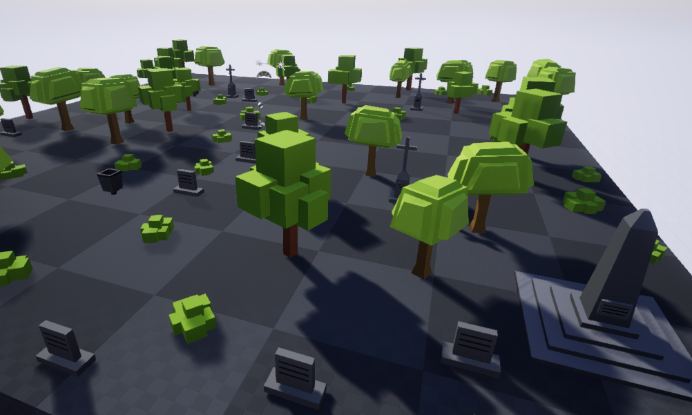
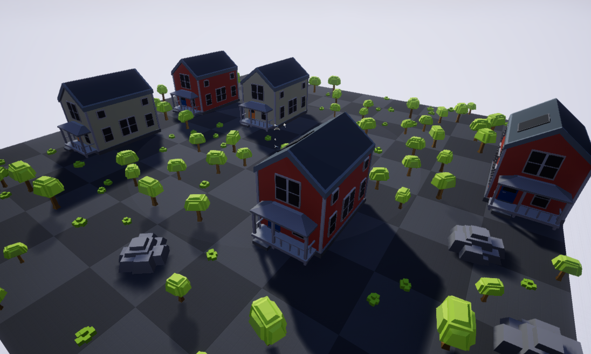

# Le Corbusier - Unreal Plugin

The main objective of this project is speed up and automatize level design tasks, introducing procedural generation techniques, applied to generation of different types of 3D environments through the distribution of objects in game levels. It has been developed as an Unreal Engine editor plugin, it works file with version 4.19.2.

> To create architecture is to put in order. Put what in order? Function and objects.
> - Le Corbusier

 
[Environments Gallery](Docs/environments) / [Demo Video](Docs/demo.mp4) / [User Guide (Spanish)](Docs/manual_spanish.pdf)

## Future work
- [ ] Support for urban environments.
- [ ] Support for 3D terrain as surface.