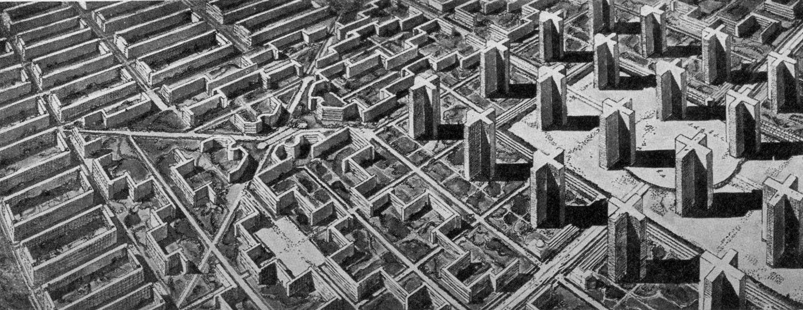

# Le Corbusier - Unreal Plugin

The main objective of this project is speed up and automatize level design tasks, introducing procedural generation techniques, applied to generation of different types of 3D environments through the distribution of objects in game levels. 

In order to achieve this an Unreal Engine editor plugin has been developed, it works fine with UE4 (4.19.2).

[Environments Gallery](http://github.com/Docs/environments) / [Demo Video](Docs/demo.mp4)

## Future work
- [ ] Support for urban environments.
- [ ] Support 3D terrain.